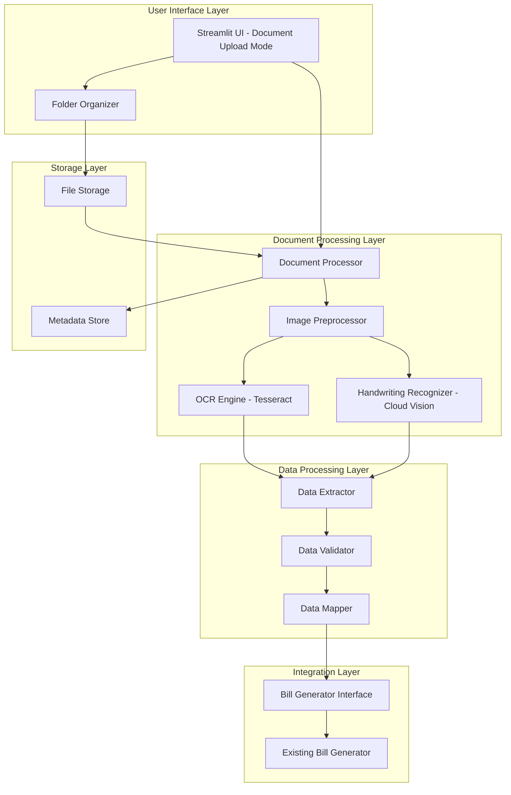
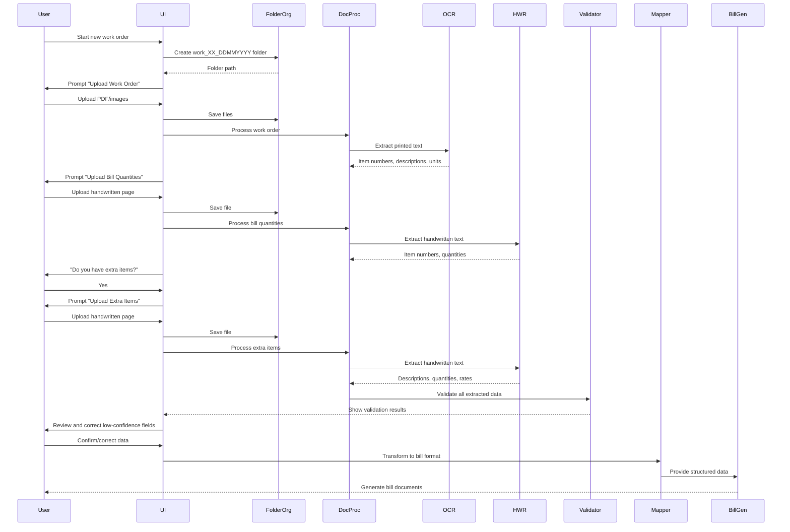
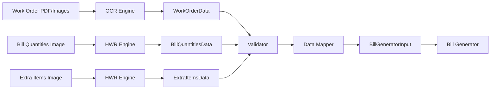

# Design Document: AI-Powered Document Input

## Overview

The AI-Powered Document Input system extends the existing BillGenerator application with intelligent document processing capabilities. It enables contractors to upload scanned work orders, handwritten bill quantities, and extra items pages, automatically extracting structured data through OCR and handwriting recognition.

### System Context

The system integrates with the existing Streamlit-based BillGenerator application (app.py) as a new input mode alongside the current Excel Upload and Online Entry modes. It processes three types of documents:

1. **Work Order Documents**: Scanned PDFs or images containing printed project specifications, item numbers, descriptions, and units
2. **Bill Quantities Pages**: Handwritten pages listing item numbers and their quantities
3. **Extra Items Pages**: Handwritten pages specifying additional items with descriptions, quantities, and rates

### Key Design Decisions

**Technology Stack Selection**:
- **OCR Engine**: Tesseract OCR via pytesseract for printed text extraction (open-source, production-ready, supports multiple languages including Hindi)
- **Handwriting Recognition**: Google Cloud Vision API or Azure Computer Vision (high accuracy for handwritten text, supports numerical and alphanumeric recognition)
- **Image Processing**: OpenCV and Pillow for preprocessing (rotation correction, enhancement, noise reduction)
- **Document Storage**: Local filesystem with organized folder structure (INPUT/work_order_samples/work_XX_DDMMYYYY/)

**Sequential Upload Workflow**:
The system implements a guided, step-by-step upload process that auto-creates dated folders and prompts users sequentially for each document type. This approach reduces cognitive load and ensures complete data collection.

**Integration Strategy**:
The system outputs data in the same format as the existing Excel processor, enabling seamless integration with the current bill generation pipeline without modifying downstream components.

## Architecture

### High-Level Architecture



### Component Responsibilities

**User Interface Layer**:
- **Streamlit UI**: Provides sequential upload prompts, displays extraction results with confidence scores, allows manual corrections
- **Folder Organizer**: Auto-creates dated folders (DDMMYYYY format), manages file organization into INPUT/work_order_samples/work_XX_DDMMYYYY/

**Document Processing Layer**:
- **Document Processor**: Orchestrates the processing pipeline, handles multi-page documents, manages error recovery
- **OCR Engine**: Extracts printed text from work order PDFs/images using Tesseract
- **Handwriting Recognizer**: Extracts handwritten text from bill quantities and extra items pages using Cloud Vision API
- **Image Preprocessor**: Applies rotation correction, contrast enhancement, noise reduction, and binarization

**Data Processing Layer**:
- **Data Extractor**: Parses OCR/HWR output into structured fields (item numbers, descriptions, quantities, rates)
- **Data Validator**: Validates extracted data against business rules (positive numbers, valid item references, required fields)
- **Data Mapper**: Transforms extracted data into the format expected by the existing Bill Generator

**Storage Layer**:
- **File Storage**: Persists original uploaded documents with metadata
- **Metadata Store**: Tracks upload timestamps, file names, extraction confidence scores, and processing status

**Integration Layer**:
- **Bill Generator Interface**: Provides data to the existing bill generation system in Excel-compatible format

### Processing Flow



## Components and Interfaces

### 1. Document Upload UI Component

**Purpose**: Provides sequential upload interface integrated into the Streamlit app

**Interface**:
```python
class DocumentUploadUI:
    def show_document_mode(self, config: Config) -> None:
        """Display document upload mode in Streamlit"""
        
    def create_work_order_session(self) -> str:
        """Create new work order folder with auto-generated ID and date"""
        
    def prompt_work_order_upload(self) -> List[UploadedFile]:
        """Prompt user to upload work order PDF or images"""
        
    def prompt_bill_quantities_upload(self) -> UploadedFile:
        """Prompt user to upload bill quantities page"""
        
    def prompt_extra_items_upload(self) -> Optional[UploadedFile]:
        """Conditionally prompt for extra items page"""
        
    def display_extraction_results(self, results: ExtractionResults) -> None:
        """Show extracted data with confidence scores"""
        
    def allow_manual_corrections(self, results: ExtractionResults) -> ExtractionResults:
        """Enable user to review and correct extracted fields"""
```

**Key Behaviors**:
- Auto-creates folder with format: work_XX_DDMMYYYY (XX increments automatically)
- Displays progress indicators during processing
- Highlights low-confidence fields (< 80%) in yellow/orange
- Provides inline editing for all extracted fields
- Shows original document thumbnails alongside extracted data

### 2. Folder Organizer Component

**Purpose**: Manages file organization and folder structure

**Interface**:
```python
class WorkOrderOrganizer:
    def __init__(self, base_path: str = "INPUT/work_order_samples"):
        """Initialize with base storage path"""
        
    def create_work_order_folder(self, work_order_id: str, date: Optional[str] = None) -> Path:
        """Create subfolder for work order (date defaults to today in DDMMYYYY format)"""
        
    def get_next_work_order_id(self) -> str:
        """Generate next available work order ID (work_01, work_02, etc.)"""
        
    def save_uploaded_file(self, file: UploadedFile, folder: Path, category: str) -> Path:
        """Save file with category prefix (work_order_, bill_quantities_, extra_items_)"""
        
    def list_work_orders(self) -> List[WorkOrderInfo]:
        """List all existing work orders with metadata"""
```

**Key Behaviors**:
- Scans existing folders to determine next work order ID
- Preserves original filenames with category prefixes
- Creates folder structure: INPUT/work_order_samples/work_XX_DDMMYYYY/
- Stores metadata JSON file in each folder with upload timestamps

### 3. Document Processor Component

**Purpose**: Orchestrates document processing pipeline

**Interface**:
```python
class DocumentProcessor:
    def __init__(self, ocr_engine: OCREngine, hwr_engine: HWREngine, 
                 preprocessor: ImagePreprocessor):
        """Initialize with processing engines"""
        
    def process_work_order(self, file_paths: List[Path]) -> WorkOrderData:
        """Extract item numbers, descriptions, and units from work order"""
        
    def process_bill_quantities(self, file_path: Path, 
                                valid_items: List[str]) -> BillQuantitiesData:
        """Extract item numbers and quantities from handwritten page"""
        
    def process_extra_items(self, file_path: Path) -> ExtraItemsData:
        """Extract descriptions, quantities, and rates from handwritten page"""
        
    def get_processing_status(self) -> ProcessingStatus:
        """Return current processing status and progress"""
```

**Key Behaviors**:
- Handles multi-page documents by processing pages sequentially
- Aggregates results from multiple pages
- Continues processing on partial failures
- Logs all processing steps for debugging
- Returns confidence scores for each extracted field

### 4. OCR Engine Component

**Purpose**: Extracts printed text from work order documents

**Interface**:
```python
class OCREngine:
    def __init__(self, language: str = "eng+hin"):
        """Initialize Tesseract with language support"""
        
    def extract_text(self, image: np.ndarray) -> OCRResult:
        """Extract all text from image with bounding boxes"""
        
    def extract_structured_data(self, image: np.ndarray, 
                               template: DocumentTemplate) -> StructuredOCRResult:
        """Extract specific fields based on document template"""
        
    def get_confidence_scores(self, result: OCRResult) -> Dict[str, float]:
        """Return confidence score for each extracted field"""
```

**Key Behaviors**:
- Uses Tesseract OCR with English and Hindi language support
- Applies template matching to identify table structures
- Extracts text with bounding box coordinates
- Provides word-level and field-level confidence scores
- Handles rotated text through preprocessing

### 5. Handwriting Recognition Component

**Purpose**: Extracts handwritten text from bill quantities and extra items pages

**Interface**:
```python
class HandwritingRecognizer:
    def __init__(self, api_key: str, provider: str = "google"):
        """Initialize with Cloud Vision or Azure credentials"""
        
    def recognize_text(self, image: np.ndarray) -> HWRResult:
        """Extract handwritten text from image"""
        
    def recognize_numbers(self, image: np.ndarray) -> List[NumberRecognition]:
        """Extract numerical values with high precision"""
        
    def recognize_item_quantity_pairs(self, image: np.ndarray) -> List[ItemQuantityPair]:
        """Extract item number and quantity pairs from structured layout"""
```

**Key Behaviors**:
- Supports Google Cloud Vision API and Azure Computer Vision
- Optimized for numerical recognition (quantities, rates)
- Handles mixed handwritten and printed text
- Returns character-level and field-level confidence scores
- Applies spatial analysis to associate related fields

### 6. Image Preprocessor Component

**Purpose**: Enhances image quality before OCR/HWR processing

**Interface**:
```python
class ImagePreprocessor:
    def preprocess(self, image: np.ndarray) -> np.ndarray:
        """Apply full preprocessing pipeline"""
        
    def correct_rotation(self, image: np.ndarray) -> np.ndarray:
        """Detect and correct image rotation"""
        
    def enhance_contrast(self, image: np.ndarray) -> np.ndarray:
        """Improve text visibility through contrast adjustment"""
        
    def remove_noise(self, image: np.ndarray) -> np.ndarray:
        """Apply noise reduction filters"""
        
    def binarize(self, image: np.ndarray) -> np.ndarray:
        """Convert to black and white for optimal OCR"""
```

**Key Behaviors**:
- Detects rotation using Hough line transform
- Applies adaptive thresholding for varying lighting conditions
- Uses morphological operations for noise removal
- Preserves original image for reference
- Configurable preprocessing pipeline based on document type

### 7. Data Extractor Component

**Purpose**: Parses OCR/HWR output into structured fields

**Interface**:
```python
class DataExtractor:
    def extract_work_order_items(self, ocr_result: OCRResult) -> List[WorkOrderItem]:
        """Parse work order text into structured items"""
        
    def extract_bill_quantities(self, hwr_result: HWRResult, 
                               valid_items: List[str]) -> Dict[str, Quantity]:
        """Parse handwritten quantities and match to item numbers"""
        
    def extract_extra_items(self, hwr_result: HWRResult) -> List[ExtraItem]:
        """Parse handwritten extra items with descriptions, quantities, rates"""
        
    def apply_extraction_rules(self, raw_data: str, rules: ExtractionRules) -> ExtractedData:
        """Apply regex patterns and business rules to extract fields"""
```

**Key Behaviors**:
- Uses regex patterns to identify item numbers (e.g., "1.1", "2.3.4")
- Applies spatial analysis to associate descriptions with item numbers
- Handles various quantity formats (integers, decimals, fractions)
- Extracts units from work orders (e.g., "sqm", "cum", "kg")
- Validates extracted data structure before returning

### 8. Data Validator Component

**Purpose**: Validates extracted data against business rules

**Interface**:
```python
class DataValidator:
    def validate_work_order(self, data: WorkOrderData) -> ValidationResult:
        """Validate work order data completeness and correctness"""
        
    def validate_bill_quantities(self, data: BillQuantitiesData, 
                                 work_order: WorkOrderData) -> ValidationResult:
        """Validate quantities reference valid work order items"""
        
    def validate_extra_items(self, data: ExtraItemsData) -> ValidationResult:
        """Validate extra items have all required fields"""
        
    def check_confidence_thresholds(self, data: Any) -> List[LowConfidenceField]:
        """Identify fields below confidence threshold"""
```

**Key Behaviors**:
- Verifies item numbers in bill quantities exist in work order
- Ensures quantities and rates are positive numbers
- Checks for required fields (item number, description, unit)
- Flags fields with confidence < 80% for manual review
- Returns specific error messages for each validation failure

### 9. Data Mapper Component

**Purpose**: Transforms extracted data into Bill Generator format

**Interface**:
```python
class DataMapper:
    def map_to_bill_format(self, work_order: WorkOrderData, 
                          bill_quantities: BillQuantitiesData,
                          extra_items: ExtraItemsData) -> BillGeneratorInput:
        """Transform all extracted data into bill generator format"""
        
    def create_excel_compatible_structure(self, data: BillGeneratorInput) -> Dict:
        """Create structure matching Excel processor output"""
        
    def merge_work_order_and_quantities(self, work_order: WorkOrderData,
                                       quantities: BillQuantitiesData) -> List[BillItem]:
        """Combine work order items with extracted quantities"""
```

**Key Behaviors**:
- Outputs data structure identical to Excel processor
- Sets quantity to 0 for work order items not in bill quantities
- Appends extra items to the end of the item list
- Preserves all metadata (confidence scores, original files)
- Ensures compatibility with existing bill generation pipeline

## Data Models

### Core Data Structures

```python
@dataclass
class WorkOrderItem:
    """Represents a single item from work order"""
    item_number: str
    description: str
    unit: str
    confidence_score: float
    page_number: int
    bounding_box: Optional[BoundingBox] = None

@dataclass
class WorkOrderData:
    """Complete work order extraction result"""
    items: List[WorkOrderItem]
    metadata: DocumentMetadata
    processing_status: ProcessingStatus

@dataclass
class ItemQuantityPair:
    """Item number and quantity from bill quantities page"""
    item_number: str
    quantity: float
    confidence_score: float
    bounding_box: Optional[BoundingBox] = None

@dataclass
class BillQuantitiesData:
    """Complete bill quantities extraction result"""
    quantities: Dict[str, ItemQuantityPair]  # item_number -> quantity
    metadata: DocumentMetadata
    processing_status: ProcessingStatus

@dataclass
class ExtraItem:
    """Additional item not in work order"""
    description: str
    quantity: float
    rate: float
    unit: str
    confidence_scores: Dict[str, float]  # field -> confidence
    bounding_box: Optional[BoundingBox] = None

@dataclass
class ExtraItemsData:
    """Complete extra items extraction result"""
    items: List[ExtraItem]
    metadata: DocumentMetadata
    processing_status: ProcessingStatus

@dataclass
class BillItem:
    """Final bill item for bill generator"""
    item_number: str
    description: str
    unit: str
    quantity: float
    rate: Optional[float] = None
    is_extra_item: bool = False

@dataclass
class BillGeneratorInput:
    """Complete input for bill generator system"""
    items: List[BillItem]
    work_order_metadata: DocumentMetadata
    extraction_metadata: ExtractionMetadata
    original_files: List[Path]

@dataclass
class DocumentMetadata:
    """Metadata for uploaded documents"""
    file_name: str
    upload_timestamp: datetime
    file_size: int
    file_type: str
    page_count: int

@dataclass
class ExtractionMetadata:
    """Metadata about extraction process"""
    processing_timestamp: datetime
    ocr_engine_version: str
    hwr_engine_version: str
    average_confidence: float
    low_confidence_fields: List[str]
    manual_corrections: List[ManualCorrection]

@dataclass
class ProcessingStatus:
    """Status of document processing"""
    status: str  # "pending", "processing", "completed", "failed", "needs_review"
    progress: float  # 0.0 to 1.0
    errors: List[ProcessingError]
    warnings: List[ProcessingWarning]

@dataclass
class ValidationResult:
    """Result of data validation"""
    is_valid: bool
    errors: List[ValidationError]
    warnings: List[ValidationWarning]
    fields_requiring_review: List[str]

@dataclass
class OCRResult:
    """Raw OCR output"""
    text: str
    words: List[Word]
    confidence: float
    language: str

@dataclass
class HWRResult:
    """Raw handwriting recognition output"""
    text: str
    lines: List[Line]
    confidence: float

@dataclass
class BoundingBox:
    """Spatial coordinates for extracted text"""
    x: int
    y: int
    width: int
    height: int
    page: int
```

### Data Flow



### Database Schema (Metadata Storage)

```sql
-- Work order sessions
CREATE TABLE work_order_sessions (
    id TEXT PRIMARY KEY,
    folder_path TEXT NOT NULL,
    created_at TIMESTAMP NOT NULL,
    status TEXT NOT NULL,
    work_order_id TEXT NOT NULL
);

-- Uploaded documents
CREATE TABLE uploaded_documents (
    id INTEGER PRIMARY KEY AUTOINCREMENT,
    session_id TEXT NOT NULL,
    document_type TEXT NOT NULL,  -- 'work_order', 'bill_quantities', 'extra_items'
    file_name TEXT NOT NULL,
    file_path TEXT NOT NULL,
    file_size INTEGER NOT NULL,
    upload_timestamp TIMESTAMP NOT NULL,
    page_count INTEGER,
    FOREIGN KEY (session_id) REFERENCES work_order_sessions(id)
);

-- Extraction results
CREATE TABLE extraction_results (
    id INTEGER PRIMARY KEY AUTOINCREMENT,
    document_id INTEGER NOT NULL,
    field_name TEXT NOT NULL,
    field_value TEXT NOT NULL,
    confidence_score REAL NOT NULL,
    manually_corrected BOOLEAN DEFAULT FALSE,
    corrected_value TEXT,
    correction_timestamp TIMESTAMP,
    FOREIGN KEY (document_id) REFERENCES uploaded_documents(id)
);

-- Processing logs
CREATE TABLE processing_logs (
    id INTEGER PRIMARY KEY AUTOINCREMENT,
    session_id TEXT NOT NULL,
    timestamp TIMESTAMP NOT NULL,
    log_level TEXT NOT NULL,
    message TEXT NOT NULL,
    component TEXT NOT NULL,
    FOREIGN KEY (session_id) REFERENCES work_order_sessions(id)
);
```


## Correctness Properties

*A property is a characteristic or behavior that should hold true across all valid executions of a system-essentially, a formal statement about what the system should do. Properties serve as the bridge between human-readable specifications and machine-verifiable correctness guarantees.*

### Property Reflection

After analyzing all acceptance criteria, I identified several areas of redundancy:

1. **File acceptance properties (1.1, 1.2, 2.1, 3.1)** can be combined into a single comprehensive property about accepting various file formats for different document types
2. **Field extraction properties (4.2, 4.3, 4.4)** are redundant - testing that all required fields are extracted is more comprehensive than testing each field individually
3. **Confidence score properties (4.5, 5.5)** can be combined since both OCR and HWR should provide confidence scores
4. **Validation properties (7.2, 7.3)** can be combined into a single property about positive numerical values
5. **Data transformation properties (8.1, 8.2, 8.3)** can be combined into one property about transforming all document types correctly
6. **Multi-page processing properties (10.1, 10.2)** both test sequential processing and can be combined

### Property 1: File Format Acceptance

*For any* uploaded file with a valid format (PDF, JPEG, PNG, TIFF) and appropriate document type (work order, bill quantities, extra items), the Document_Processor should accept the file without errors.

**Validates: Requirements 1.1, 1.2, 2.1, 3.1**

### Property 2: Invalid File Rejection

*For any* uploaded file with an invalid format, the Document_Processor should reject the file and return a descriptive error message indicating the format issue.

**Validates: Requirements 1.3, 1.4**

### Property 3: Item-Quantity Mapping

*For any* bill quantities page and work order, when an item number appears in the bill quantities, the final structured data should contain that item with the extracted quantity value.

**Validates: Requirements 2.2, 2.4**

### Property 4: Missing Item Default Quantity

*For any* work order item that does not appear in the bill quantities page, the final structured data should set that item's quantity to zero.

**Validates: Requirements 2.5**

### Property 5: Extra Items Field Extraction

*For any* extra items page, the Document_Processor should extract all three required fields (specification, quantity, rate) and associate them correctly for each item.

**Validates: Requirements 3.2, 3.4, 3.5**

### Property 6: Work Order Field Completeness

*For any* work order document, the OCR_Engine should extract all required fields (item number, description, unit) for each item present in the document.

**Validates: Requirements 4.1, 4.2, 4.3, 4.4**

### Property 7: Confidence Score Provision

*For any* extracted field from either OCR or handwriting recognition, the system should provide an extraction confidence score between 0 and 1.

**Validates: Requirements 4.5, 5.5**

### Property 8: Handwriting Recognition Extraction

*For any* handwritten bill quantities or extra items page, the Handwriting_Recognizer should extract the appropriate fields (item numbers and quantities for bill quantities; specifications, quantities, and rates for extra items).

**Validates: Requirements 5.1, 5.2, 5.3, 5.4**

### Property 9: Low Confidence Flagging

*For any* extracted field with confidence score below 0.8, the Document_Processor should flag that field for manual review.

**Validates: Requirements 6.1, 6.3**

### Property 10: Partial Processing Continuation

*For any* document where some fields fail extraction, the Document_Processor should complete processing for all valid fields and log errors for failed fields.

**Validates: Requirements 6.4, 6.5**

### Property 11: Item Number Validation

*For any* bill quantities data, all item numbers should exist in the corresponding work order data, or the Data_Validator should report a validation error.

**Validates: Requirements 7.1**

### Property 12: Positive Numerical Validation

*For any* extracted quantity or rate value, the Data_Validator should verify it is a positive number, or report a validation error with a specific message indicating which field is invalid.

**Validates: Requirements 7.2, 7.3, 7.4**

### Property 13: Bill Generator Format Compatibility

*For any* extracted and validated data (work order, bill quantities, extra items), the Data_Mapper should transform it into structured data that contains all required fields expected by the Bill_Generator.

**Validates: Requirements 8.1, 8.2, 8.3, 8.4**

### Property 14: Manual Correction Application

*For any* extracted field that a user manually corrects, the structured data should reflect the corrected value while retaining the original extracted value for audit purposes.

**Validates: Requirements 9.4, 9.5**

### Property 15: Multi-Page Sequential Processing

*For any* multi-page document (PDF or multiple images), the Document_Processor should process all pages in the provided order and aggregate results into a single structured data output with page number metadata for each item.

**Validates: Requirements 10.1, 10.2, 10.3, 10.4**

### Property 16: Page Failure Isolation

*For any* multi-page document where processing fails on one page, the Document_Processor should continue processing remaining pages and include successfully processed data in the output.

**Validates: Requirements 10.5**

### Property 17: Rotation Correction

*For any* document that is rotated, the Image_Preprocessor should detect the rotation and correct the orientation before passing to OCR/HWR engines.

**Validates: Requirements 11.1**

### Property 18: Image Enhancement Application

*For any* document with poor image quality (low contrast, noise), the Image_Preprocessor should apply enhancement techniques before extraction.

**Validates: Requirements 11.2**

### Property 19: Mixed Content Processing

*For any* document containing both handwritten and printed text, the Document_Processor should process both types appropriately and extract all relevant fields.

**Validates: Requirements 11.3**

### Property 20: Relevant Field Extraction

*For any* document containing both relevant and irrelevant content, the Document_Processor should extract only the relevant fields (item numbers, descriptions, quantities, rates) and ignore extraneous content.

**Validates: Requirements 11.4**

### Property 21: Error Logging and Recovery

*For any* unexpected error during processing, the Document_Processor should log the error details, notify the user, and allow retry or manual input without crashing.

**Validates: Requirements 11.5**

### Property 22: Original File Persistence

*For any* uploaded document, the Document_Processor should store the original file with metadata (upload timestamp, file name) and associate it with the corresponding bill record.

**Validates: Requirements 12.1, 12.2, 12.4**


## Error Handling

### Error Categories

**1. File Upload Errors**
- Invalid file format
- File size exceeds limits
- Corrupted file
- Empty file

**Handling Strategy**: Validate file format and size before processing. Return descriptive error messages to user. Allow retry with different file.

**2. Image Quality Errors**
- Blank or nearly blank images
- Extremely low resolution
- Severe distortion or damage
- Unreadable due to poor scanning

**Handling Strategy**: Apply image enhancement preprocessing. If still unreadable after enhancement, flag for manual input. Provide preview of preprocessed image to user.

**3. OCR/HWR Extraction Errors**
- Low confidence extraction (< 80%)
- No text detected
- Ambiguous characters
- Unexpected document structure

**Handling Strategy**: Flag low-confidence fields for manual review. Continue processing other fields. Provide original image region alongside extracted text for user verification.

**4. Data Validation Errors**
- Item number not found in work order
- Negative or zero quantities/rates
- Missing required fields
- Data type mismatches

**Handling Strategy**: Collect all validation errors and present to user in a structured format. Highlight invalid fields in UI. Allow inline correction before proceeding to bill generation.

**5. Processing Pipeline Errors**
- OCR engine failure
- HWR API timeout or quota exceeded
- Image preprocessing failure
- Database write failure

**Handling Strategy**: Log detailed error information. Implement retry logic with exponential backoff for transient failures. Provide fallback to manual entry mode. Preserve partial results.

**6. Integration Errors**
- Bill Generator format mismatch
- Missing required fields for bill generation
- Data transformation failure

**Handling Strategy**: Validate output format against Bill Generator schema before handoff. Log transformation errors with input/output data. Provide clear error messages indicating which fields are problematic.

### Error Recovery Mechanisms

**Graceful Degradation**:
- If OCR fails, allow manual entry of work order items
- If HWR fails, provide manual entry form for quantities
- If preprocessing fails, attempt processing with original image
- If one page fails in multi-page document, process remaining pages

**User Feedback**:
- Progress indicators during processing
- Real-time error notifications
- Confidence score visualization
- Side-by-side comparison of original image and extracted data

**Retry Logic**:
- Automatic retry for transient API failures (3 attempts with exponential backoff)
- User-initiated retry for entire document or specific pages
- Option to adjust preprocessing parameters and retry

**Audit Trail**:
- Log all processing steps with timestamps
- Record all errors with context (document, page, field)
- Track manual corrections with user ID and timestamp
- Preserve original extracted values alongside corrections

### Error Messages

All error messages should follow this format:
- **Clear description**: What went wrong
- **Context**: Which document/page/field
- **Actionable guidance**: What the user can do
- **Technical details**: (collapsible) For debugging

Example:
```
❌ Low Confidence Extraction
Field: Item 2.3 Quantity
Confidence: 65%
Extracted Value: "8.5" (uncertain)
Action: Please verify this value against the original document
[View Original Image Region]
```

## Testing Strategy

### Dual Testing Approach

The system requires both unit tests and property-based tests for comprehensive coverage:

**Unit Tests**: Focus on specific examples, edge cases, and integration points
**Property Tests**: Verify universal properties across randomized inputs

### Unit Testing Strategy

**Component-Level Tests**:

1. **File Upload Component**
   - Test specific file formats (PDF, JPEG, PNG, TIFF)
   - Test file size limits (boundary: 50 pages)
   - Test corrupted file handling
   - Test empty file handling

2. **Image Preprocessor**
   - Test rotation correction at specific angles (90°, 180°, 270°)
   - Test contrast enhancement on low-contrast images
   - Test noise reduction on noisy images
   - Test binarization on various lighting conditions

3. **OCR Engine**
   - Test extraction from sample work order documents
   - Test Hindi and English text recognition
   - Test table structure recognition
   - Test confidence score calculation

4. **Handwriting Recognizer**
   - Test numerical digit recognition (0-9)
   - Test alphanumeric item numbers (e.g., "1.2.3", "A-5")
   - Test decimal number recognition
   - Test handwriting style variations

5. **Data Validator**
   - Test positive number validation
   - Test item number existence validation
   - Test required field validation
   - Test error message generation

6. **Data Mapper**
   - Test transformation to Bill Generator format
   - Test preservation of all required fields
   - Test handling of extra items
   - Test quantity zero assignment for missing items

7. **Integration Tests**
   - Test end-to-end flow: upload → extract → validate → transform → bill generation
   - Test sequential upload workflow
   - Test folder organization
   - Test metadata persistence

**Edge Cases to Test**:
- 50-page document (maximum)
- Blank or nearly blank pages
- Documents with only irrelevant content
- Mixed handwritten and printed text
- Rotated documents (various angles)
- Poor quality scans
- Documents with unusual layouts
- Item numbers with special formats

### Property-Based Testing Strategy

**Testing Library**: Use `hypothesis` for Python property-based testing

**Test Configuration**: Minimum 100 iterations per property test

**Property Test Implementation**:

Each correctness property from the design document should be implemented as a property-based test with the following tag format:

```python
# Feature: ai-powered-document-input, Property 1: File Format Acceptance
@given(file_format=st.sampled_from(['pdf', 'jpeg', 'png', 'tiff']),
       document_type=st.sampled_from(['work_order', 'bill_quantities', 'extra_items']))
@settings(max_examples=100)
def test_file_format_acceptance(file_format, document_type):
    """For any uploaded file with valid format and document type, 
    the Document_Processor should accept without errors"""
    # Test implementation
```

**Property Tests to Implement**:

1. **Property 1: File Format Acceptance**
   - Generate random valid files of each format
   - Verify acceptance without errors

2. **Property 2: Invalid File Rejection**
   - Generate random invalid file formats
   - Verify rejection with descriptive error

3. **Property 3: Item-Quantity Mapping**
   - Generate random work orders and bill quantities
   - Verify quantities match extracted values

4. **Property 4: Missing Item Default Quantity**
   - Generate random work orders with subset in bill quantities
   - Verify missing items have quantity zero

5. **Property 5: Extra Items Field Extraction**
   - Generate random extra items pages
   - Verify all three fields extracted and associated

6. **Property 6: Work Order Field Completeness**
   - Generate random work orders
   - Verify all required fields extracted

7. **Property 7: Confidence Score Provision**
   - Generate random documents
   - Verify all extracted fields have confidence scores in [0, 1]

8. **Property 8: Handwriting Recognition Extraction**
   - Generate random handwritten pages
   - Verify appropriate fields extracted

9. **Property 9: Low Confidence Flagging**
   - Generate extractions with various confidence scores
   - Verify fields < 0.8 are flagged

10. **Property 10: Partial Processing Continuation**
    - Generate documents with some invalid fields
    - Verify valid fields processed, errors logged

11. **Property 11: Item Number Validation**
    - Generate random bill quantities with valid/invalid item numbers
    - Verify validation catches invalid references

12. **Property 12: Positive Numerical Validation**
    - Generate random quantities and rates (positive, negative, zero)
    - Verify only positive values pass validation

13. **Property 13: Bill Generator Format Compatibility**
    - Generate random extracted data
    - Verify transformed output has all required fields

14. **Property 14: Manual Correction Application**
    - Generate random extractions and corrections
    - Verify corrections applied, originals retained

15. **Property 15: Multi-Page Sequential Processing**
    - Generate random multi-page documents
    - Verify all pages processed in order, aggregated correctly

16. **Property 16: Page Failure Isolation**
    - Generate multi-page documents with some failing pages
    - Verify successful pages still processed

17. **Property 17: Rotation Correction**
    - Generate randomly rotated images
    - Verify rotation detected and corrected

18. **Property 18: Image Enhancement Application**
    - Generate poor quality images
    - Verify enhancement applied before extraction

19. **Property 19: Mixed Content Processing**
    - Generate documents with mixed handwritten/printed text
    - Verify both types processed

20. **Property 20: Relevant Field Extraction**
    - Generate documents with relevant and irrelevant content
    - Verify only relevant fields extracted

21. **Property 21: Error Logging and Recovery**
    - Generate scenarios causing errors
    - Verify errors logged, user notified, recovery possible

22. **Property 22: Original File Persistence**
    - Generate random uploads
    - Verify files stored with metadata and associations

**Generator Strategies**:

```python
# Example generators for property tests

@st.composite
def work_order_document(draw):
    """Generate random work order document"""
    num_items = draw(st.integers(min_value=1, max_value=50))
    items = []
    for i in range(num_items):
        item = {
            'item_number': draw(st.text(alphabet=st.characters(whitelist_categories=('Nd', 'L')), min_size=1, max_size=10)),
            'description': draw(st.text(min_size=10, max_size=100)),
            'unit': draw(st.sampled_from(['sqm', 'cum', 'kg', 'nos', 'rmt']))
        }
        items.append(item)
    return items

@st.composite
def bill_quantities_data(draw, work_order_items):
    """Generate random bill quantities for subset of work order items"""
    num_items = draw(st.integers(min_value=0, max_value=len(work_order_items)))
    selected_items = draw(st.lists(st.sampled_from(work_order_items), min_size=num_items, max_size=num_items, unique=True))
    quantities = {}
    for item in selected_items:
        quantities[item['item_number']] = draw(st.floats(min_value=0.1, max_value=10000.0))
    return quantities

@st.composite
def confidence_score(draw):
    """Generate random confidence score"""
    return draw(st.floats(min_value=0.0, max_value=1.0))
```

### Test Data

**Sample Documents**:
- Use real work order samples from INPUT/work_order_samples/work_01_27022026/
- Create synthetic test documents with known content
- Generate documents with various quality levels
- Create documents with edge cases (rotated, poor quality, mixed content)

**Mock Services**:
- Mock Google Cloud Vision API responses for consistent testing
- Mock Tesseract OCR outputs
- Mock file system operations for unit tests

### Continuous Integration

**Pre-commit Checks**:
- Run unit tests
- Run property tests (reduced iterations: 20 for speed)
- Check code coverage (target: 80%)

**CI Pipeline**:
- Run full unit test suite
- Run full property test suite (100 iterations)
- Integration tests with sample documents
- Performance tests (processing time benchmarks)

**Test Coverage Goals**:
- Unit test coverage: 80% minimum
- Property test coverage: All 22 properties implemented
- Integration test coverage: All user workflows
- Edge case coverage: All identified edge cases tested

