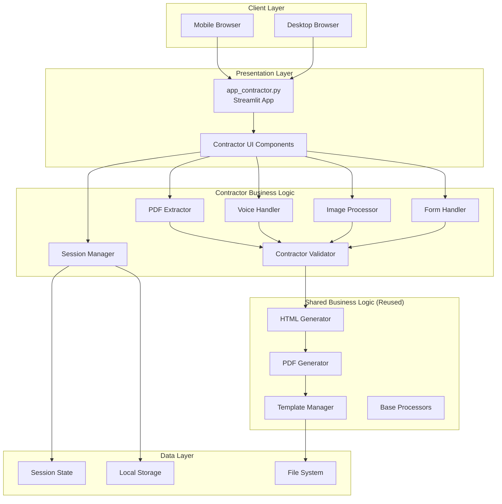
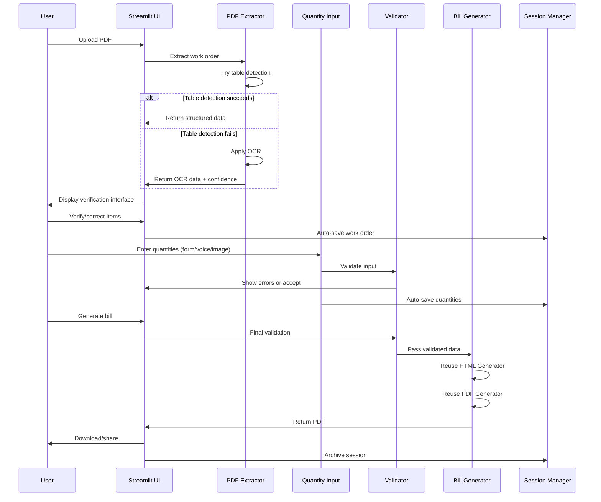
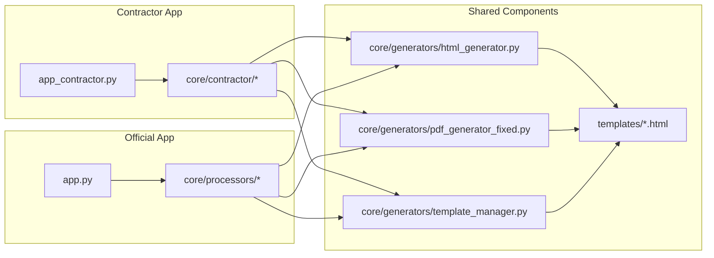

# Design Document: Contractor-Friendly Bill Generator

## Overview

The Contractor-Friendly Bill Generator is a mobile-first web application that extends the BillGenerator Unified system (v2.0.3) to serve contractors who work with scanned PDF work orders and need to generate bills through simplified, accessible interfaces. The system bridges the gap between field conditions (mobile devices, handwritten notes, scanned documents) and PWD's technical requirements while maintaining full compatibility with existing bill processing systems.

### Design Philosophy

1. **Reuse Over Rebuild**: Leverage existing BillGenerator Unified components (generators, templates, processors) to ensure consistency and reduce maintenance burden
2. **Progressive Enhancement**: Core functionality works offline; enhanced features activate with connectivity
3. **Mobile-First**: Design for touch interfaces and constrained screens, then enhance for desktop
4. **Accessibility**: Support users with varying technical literacy and physical abilities
5. **Fault Tolerance**: Graceful degradation when OCR fails, connectivity drops, or input quality is poor

### Key Design Decisions

**Decision 1: Streamlit for Frontend**
- Rationale: Consistency with existing app.py, rapid development, built-in session management
- Trade-off: Limited offline capability compared to React PWA, but acceptable given progressive enhancement strategy

**Decision 2: Hybrid PDF Extraction**
- Rationale: Structured PDFs need table detection; scanned images need OCR; real-world documents vary
- Approach: Try pdfplumber first, fall back to Tesseract OCR, always allow manual correction

**Decision 3: Separate Namespace for Contractor Components**
- Rationale: Clear separation of concerns, easier testing, prevents coupling with official workflow
- Structure: `core/contractor/` contains all contractor-specific logic

**Decision 4: Session State for Data Persistence**
- Rationale: Streamlit session_state + browser localStorage provides adequate persistence without database complexity
- Trade-off: Limited to single-device usage, but acceptable for MVP

**Decision 5: Web Speech API for Voice Input**
- Rationale: Browser-native, no server processing, works offline
- Trade-off: Browser support varies, but provides fallback to manual input

## Architecture

### System Architecture



### Data Flow Architecture



### Integration Architecture with BillGenerator Unified



## Components and Interfaces

### Component 1: PDF Extractor Module

**Location**: `core/contractor/pdf/pdf_extractor.py`

**Responsibilities**:
- Accept PDF/image uploads up to 10MB
- Detect if PDF contains structured tables or scanned images
- Extract work order data using appropriate method
- Return structured data with confidence scores

**Interface**:
```python
class PDFExtractor:
    def extract_work_order(self, file_path: str) -> WorkOrderData:
        """
        Extract work order from PDF/image file.
        
        Args:
            file_path: Path to uploaded file
            
        Returns:
            WorkOrderData with items and confidence scores
            
        Raises:
            ExtractionError: If extraction fails completely
        """
        pass
    
    def _detect_pdf_type(self, file_path: str) -> PDFType:
        """Determine if PDF is structured or scanned."""
        pass
    
    def _extract_table(self, file_path: str) -> List[Dict]:
        """Extract using pdfplumber for structured PDFs."""
        pass
    
    def _extract_ocr(self, file_path: str) -> List[Dict]:
        """Extract using Tesseract for scanned images."""
        pass
```

**Algorithm: Hybrid Extraction**
```
1. Load PDF file
2. Detect PDF type:
   a. Check for embedded text (structured)
   b. Check for images only (scanned)
3. If structured:
   a. Use pdfplumber to detect tables
   b. Extract rows and columns
   c. Map to WorkOrder schema
   d. Set confidence = 0.95
4. If scanned:
   a. Convert pages to images
   b. Preprocess: grayscale, denoise, deskew
   c. Apply Tesseract OCR with Hindi+English
   d. Parse text using regex patterns
   e. Calculate confidence per field
5. If confidence < 0.8 for any field:
   a. Flag for manual verification
6. Return WorkOrderData
```

**Dependencies**:
- pdfplumber: Table detection
- pdf2image: PDF to image conversion
- Pillow: Image preprocessing
- pytesseract: OCR engine
- opencv-python: Image enhancement

### Component 2: OCR Processor Module

**Location**: `core/contractor/pdf/ocr_processor.py`

**Responsibilities**:
- Preprocess images for optimal OCR
- Apply Tesseract with Hindi and English language packs
- Parse extracted text into structured data
- Calculate confidence scores

**Interface**:
```python
class OCRProcessor:
    def __init__(self, languages: List[str] = ['eng', 'hin']):
        """Initialize with language packs."""
        pass
    
    def preprocess_image(self, image: np.ndarray) -> np.ndarray:
        """
        Enhance image quality for OCR.
        
        Steps:
        - Convert to grayscale
        - Apply adaptive thresholding
        - Deskew using Hough transform
        - Denoise using bilateral filter
        """
        pass
    
    def extract_text(self, image: np.ndarray) -> OCRResult:
        """
        Extract text with confidence scores.
        
        Returns:
            OCRResult with text, bounding boxes, and confidence
        """
        pass
    
    def parse_work_order(self, ocr_result: OCRResult) -> List[WorkOrderItem]:
        """
        Parse OCR text into structured work order items.
        
        Uses regex patterns:
        - Item number: \d+
        - Description: [A-Za-z\s]+
        - Quantity: \d+\.?\d*
        - Unit: (Nos|Cum|Sqm|Rmt|etc)
        - Rate: \d+\.?\d*
        """
        pass
```

**Algorithm: Image Preprocessing**
```
1. Load image as numpy array
2. Convert to grayscale
3. Apply Gaussian blur (kernel=5x5)
4. Apply adaptive threshold (block_size=11, C=2)
5. Detect skew angle:
   a. Apply Canny edge detection
   b. Use Hough line transform
   c. Calculate median angle
6. Rotate image to correct skew
7. Apply bilateral filter to denoise
8. Resize if DPI < 300
9. Return preprocessed image
```

### Component 3: Voice Input Handler

**Location**: `core/contractor/input/voice_handler.py`

**Responsibilities**:
- Interface with Web Speech API
- Parse natural language quantity commands
- Handle Hindi and English voice input
- Provide confirmation dialogs for ambiguous input

**Interface**:
```python
class VoiceInputHandler:
    def __init__(self, language: str = 'en-IN'):
        """Initialize with language code."""
        pass
    
    def start_listening(self) -> None:
        """Activate microphone and start recognition."""
        pass
    
    def parse_command(self, transcript: str) -> QuantityInput:
        """
        Parse voice command into structured input.
        
        Supported patterns:
        - "item twelve, fifteen numbers"
        - "item number twelve, quantity fifteen"
        - "बारह नंबर, पंद्रह संख्या"
        
        Returns:
            QuantityInput with item_number and quantity
        """
        pass
    
    def get_confidence(self) -> float:
        """Return recognition confidence score."""
        pass
```

**Algorithm: Voice Command Parsing**
```
1. Receive transcript from Web Speech API
2. Normalize text:
   a. Convert to lowercase
   b. Remove punctuation
   c. Trim whitespace
3. Detect language (English/Hindi)
4. Apply pattern matching:
   Pattern 1: "item <number>, <quantity> <unit>"
   Pattern 2: "item number <number>, quantity <quantity>"
   Pattern 3: "<number> <unit> for item <number>"
5. Extract item_number and quantity using regex
6. If multiple matches, return ambiguous flag
7. Return QuantityInput with confidence
```

### Component 4: Image Processor for Handwritten Notes

**Location**: `core/contractor/input/image_handler.py`

**Responsibilities**:
- Capture photos from device camera
- Extract handwritten quantities using OCR
- Match quantities to work order items
- Handle multiple photos for different note sections

**Interface**:
```python
class ImageHandler:
    def __init__(self):
        """Initialize with Tesseract configuration for handwriting."""
        pass
    
    def capture_image(self) -> np.ndarray:
        """Activate camera and capture photo."""
        pass
    
    def extract_quantities(self, image: np.ndarray, 
                          work_order: WorkOrderData) -> List[QuantityInput]:
        """
        Extract item-quantity pairs from handwritten notes.
        
        Args:
            image: Photo of handwritten notes
            work_order: Reference work order for item matching
            
        Returns:
            List of QuantityInput with confidence scores
        """
        pass
    
    def resolve_conflicts(self, inputs: List[QuantityInput]) -> List[QuantityInput]:
        """Handle duplicate item entries from multiple photos."""
        pass
```

**Algorithm: Handwriting Recognition**
```
1. Capture image from camera
2. Preprocess:
   a. Convert to grayscale
   b. Apply morphological operations to enhance text
   c. Binarize using Otsu's method
3. Apply Tesseract with handwriting model
4. Parse extracted text:
   a. Look for patterns: "<item_no>: <quantity>"
   b. Look for patterns: "<item_no> - <quantity>"
   c. Look for patterns: "<quantity> for <item_no>"
5. Match item numbers to work order
6. Calculate confidence based on:
   a. OCR confidence
   b. Item number match
   c. Quantity format validity
7. Flag items with confidence < 0.7
8. Return List[QuantityInput]
```

### Component 5: Form Handler

**Location**: `core/contractor/input/form_handler.py`

**Responsibilities**:
- Render quantity input form
- Validate input in real-time
- Calculate running totals
- Auto-save every 30 seconds

**Interface**:
```python
class FormHandler:
    def __init__(self, work_order: WorkOrderData):
        """Initialize with work order data."""
        pass
    
    def render_form(self) -> None:
        """Render Streamlit form with quantity inputs."""
        pass
    
    def validate_quantity(self, item: WorkOrderItem, 
                         quantity: float) -> ValidationResult:
        """
        Validate quantity input.
        
        Checks:
        - Non-negative
        - Appropriate precision for unit type
        - Warning if > 110% of work order quantity
        """
        pass
    
    def calculate_totals(self, quantities: Dict[str, float]) -> BillTotals:
        """Calculate line totals and grand total."""
        pass
    
    def auto_save(self) -> None:
        """Save form state to session."""
        pass
```

### Component 6: Contractor Validator

**Location**: `core/contractor/validation/contractor_validator.py`

**Responsibilities**:
- Validate work order data after extraction
- Validate quantity inputs before bill generation
- Provide detailed error messages
- Check data integrity

**Interface**:
```python
class ContractorValidator:
    def validate_work_order(self, work_order: WorkOrderData) -> ValidationResult:
        """
        Validate extracted work order data.
        
        Checks:
        - All required fields present
        - Item numbers are unique
        - Rates are positive
        - Units are valid
        """
        pass
    
    def validate_quantities(self, quantities: Dict[str, float],
                           work_order: WorkOrderData) -> ValidationResult:
        """
        Validate quantity inputs.
        
        Checks:
        - All items have quantities (or explicitly zero)
        - Quantities match unit precision
        - Total bill amount > 0
        - No negative values
        """
        pass
    
    def validate_bill_data(self, bill_data: BillData) -> ValidationResult:
        """Final validation before generation."""
        pass
```

### Component 7: Session Manager

**Location**: `core/contractor/session/session_manager.py`

**Responsibilities**:
- Auto-save work order and quantities to session state
- Persist to browser localStorage
- Restore sessions on app reload
- Archive completed sessions
- Manage session lifecycle

**Interface**:
```python
class SessionManager:
    def __init__(self):
        """Initialize with Streamlit session state."""
        pass
    
    def save_work_order(self, work_order: WorkOrderData) -> None:
        """Save work order to session and localStorage."""
        pass
    
    def save_quantities(self, quantities: Dict[str, float]) -> None:
        """Save quantities to session and localStorage."""
        pass
    
    def restore_session(self) -> Optional[SessionData]:
        """Restore last session from localStorage."""
        pass
    
    def archive_session(self, bill_id: str) -> None:
        """Move completed session to history."""
        pass
    
    def clear_session(self) -> None:
        """Clear current session data."""
        pass
    
    def get_history(self, days: int = 90) -> List[SessionData]:
        """Retrieve historical sessions."""
        pass
```

### Component 8: Bill Generator Integration

**Location**: `core/contractor/bill_generator.py`

**Responsibilities**:
- Transform contractor data to BillGenerator Unified format
- Invoke existing HTML and PDF generators
- Apply contractor-specific template
- Return generated PDF

**Interface**:
```python
class ContractorBillGenerator:
    def __init__(self):
        """Initialize with references to shared generators."""
        self.html_generator = HTMLGenerator
        self.pdf_generator = FixedPDFGenerator()
        self.template_manager = TemplateManager()
    
    def generate_bill(self, work_order: WorkOrderData,
                     quantities: Dict[str, float],
                     contractor_info: ContractorInfo) -> bytes:
        """
        Generate bill PDF.
        
        Steps:
        1. Transform to BillGenerator format
        2. Generate HTML using shared generator
        3. Generate PDF using shared generator
        4. Return PDF bytes
        """
        pass
    
    def _transform_to_unified_format(self, work_order: WorkOrderData,
                                    quantities: Dict[str, float]) -> Dict:
        """Convert contractor data to BillGenerator Unified format."""
        pass
```

## Data Models

### WorkOrderData

```python
@dataclass
class WorkOrderItem:
    """Single item in work order."""
    item_number: str
    description: str
    unit: str
    quantity: float
    rate: float
    confidence: float = 1.0  # Extraction confidence (0.0-1.0)
    
    def line_total(self, executed_qty: float) -> float:
        """Calculate line total for executed quantity."""
        return executed_qty * self.rate

@dataclass
class WorkOrderData:
    """Complete work order information."""
    work_order_number: str
    work_order_date: date
    contractor_name: str
    project_name: str
    items: List[WorkOrderItem]
    extraction_method: str  # 'table' or 'ocr'
    extraction_timestamp: datetime
    
    def get_item(self, item_number: str) -> Optional[WorkOrderItem]:
        """Retrieve item by number."""
        pass
    
    def total_work_order_value(self) -> float:
        """Calculate total work order value."""
        return sum(item.quantity * item.rate for item in self.items)
```

### QuantityInput

```python
@dataclass
class QuantityInput:
    """Quantity input from any source."""
    item_number: str
    executed_quantity: float
    input_method: str  # 'form', 'voice', 'image', 'manual'
    confidence: float = 1.0
    timestamp: datetime = field(default_factory=datetime.now)
    
    def is_valid(self) -> bool:
        """Check if quantity is valid."""
        return self.executed_quantity >= 0
```

### BillData

```python
@dataclass
class BillLineItem:
    """Single line in generated bill."""
    serial_no: int
    item_number: str
    description: str
    unit: str
    work_order_quantity: float
    executed_quantity: float
    rate: float
    amount: float
    
    def __post_init__(self):
        """Calculate amount."""
        self.amount = self.executed_quantity * self.rate

@dataclass
class BillData:
    """Complete bill information."""
    bill_number: str
    bill_date: date
    work_order_number: str
    contractor_info: ContractorInfo
    line_items: List[BillLineItem]
    subtotal: float
    gst_rate: float
    gst_amount: float
    total_amount: float
    
    def calculate_totals(self) -> None:
        """Calculate all totals."""
        self.subtotal = sum(item.amount for item in self.line_items)
        self.gst_amount = self.subtotal * self.gst_rate
        self.total_amount = self.subtotal + self.gst_amount
```

### SessionData

```python
@dataclass
class SessionData:
    """Session state information."""
    session_id: str
    work_order: Optional[WorkOrderData]
    quantities: Dict[str, float]  # item_number -> executed_quantity
    contractor_info: Optional[ContractorInfo]
    status: str  # 'draft', 'completed', 'archived'
    created_at: datetime
    updated_at: datetime
    
    def is_complete(self) -> bool:
        """Check if session has all required data."""
        return (self.work_order is not None and 
                len(self.quantities) > 0 and
                self.contractor_info is not None)
```

### ContractorInfo

```python
@dataclass
class ContractorInfo:
    """Contractor identification."""
    contractor_id: str
    name: str
    mobile_number: str
    email: Optional[str]
    address: str
    gst_number: Optional[str]
```

### OCRResult

```python
@dataclass
class OCRResult:
    """Result from OCR processing."""
    text: str
    confidence: float
    bounding_boxes: List[BoundingBox]
    language: str
    
@dataclass
class BoundingBox:
    """Text bounding box from OCR."""
    text: str
    confidence: float
    x: int
    y: int
    width: int
    height: int
```

### ValidationResult

```python
@dataclass
class ValidationError:
    """Single validation error."""
    field: str
    message: str
    severity: str  # 'error', 'warning'

@dataclass
class ValidationResult:
    """Result of validation."""
    is_valid: bool
    errors: List[ValidationError]
    warnings: List[ValidationError]
    
    def has_errors(self) -> bool:
        """Check if there are blocking errors."""
        return len(self.errors) > 0
    
    def get_error_summary(self) -> str:
        """Get formatted error summary."""
        pass
```

