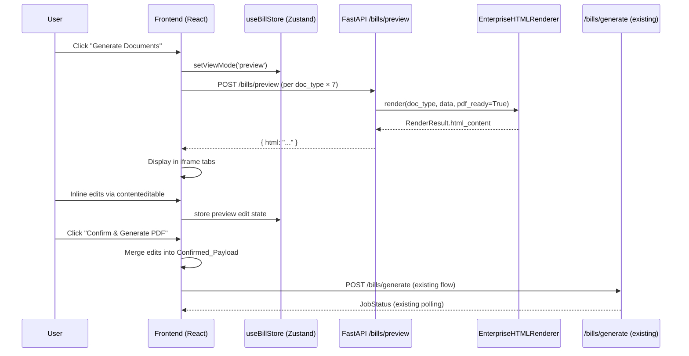

# Design Document: Pre-PDF Browser Preview

## Overview

This feature inserts a "Preview & Edit" step between the bill editor (`edit` view) and the PDF generation pipeline. When the user clicks "Generate Documents", the app transitions to a new `preview` view mode instead of immediately enqueuing a PDF job. The preview fetches rendered HTML for each of the 7 document types from a new `/bills/preview` backend endpoint, displays them in a tabbed iframe-sandboxed panel, allows inline `contenteditable` editing, and only submits to the existing `/bills/generate` pipeline once the user confirms.

The design reuses the existing `EnterpriseHTMLRenderer` and Jinja2 templates without modification, ensuring the preview is visually identical to the final PDF output.

---

## Architecture



The 7 preview requests are fired in parallel (Promise.allSettled) to minimise total wait time. Each resolves independently so a failure in one tab does not block others.

---

## Components and Interfaces

### Backend: `POST /bills/preview`

New route added to `backend/routes/bills.py`.

**Request model** (`PreviewRequest` in `backend/models.py`):
```python
class PreviewRequest(BaseModel):
    document_type: str          # must be a valid DocumentType value
    fileId: str
    titleData: dict
    billItems: list[BillItem]
    extraItems: list[ExtraItem]
    options: GenerateOptions = Field(default_factory=GenerateOptions)
```

**Response model** (`PreviewResponse` in `backend/models.py`):
```python
class PreviewResponse(BaseModel):
    document_type: str
    html: str
```

The endpoint:
1. Validates `document_type` against `DocumentType` enum — returns 422 on failure.
2. Builds `template_data` the same way `BillService.process_generation` does.
3. Instantiates `EnterpriseHTMLRenderer` with `RenderConfig(pdf_ready=True, template_dir=..., output_dir=...)`.
4. Calls `renderer.render(doc_type, template_data)` — no file write needed (no `output_filename`).
5. Returns `PreviewResponse(document_type=..., html=result.html_content)`.

No Redis, no job queue — this is a synchronous, stateless render call. Response time target: < 3 000 ms.

### Frontend: `api.preview()`

New method added to `frontend/src/lib/api.ts`:

```typescript
export interface PreviewRequest {
  document_type: string;
  fileId: string;
  titleData: Record<string, string>;
  billItems: BillItemAPI[];
  extraItems: ExtraItemAPI[];
  options: GenerateOptions;
}

export interface PreviewResponse {
  document_type: string;
  html: string;
}
```

```typescript
preview: (req: PreviewRequest): Promise<PreviewResponse> =>
  request<PreviewResponse>('/bills/preview', {
    method: 'POST',
    headers: { 'Content-Type': 'application/json' },
    body: JSON.stringify(req),
    timeoutMs: 3000,
  }),
```

### Frontend: `PreviewPanel` component

New file: `frontend/src/components/PreviewPanel.tsx`

Responsibilities:
- Reads `header`, `billItems`, `parsedData`, `templateVersion` from `useBillStore`.
- On mount, fires 7 parallel `api.preview()` calls (one per `DocumentType`).
- Renders a tab bar with one tab per document type.
- Each tab contains an `<iframe srcDoc={html}>` for style isolation.
- Tracks per-tab loading / error / loaded state.
- Injects a `<script>` into each iframe's HTML that posts `contenteditable` change events back to the parent via `window.parent.postMessage`.
- Maintains local `previewEdits: Record<string, Record<string, string>>` state (keyed by `document_type → fieldId → newValue`).
- "Confirm & Generate PDF" button: merges edits into the generate payload and calls `setViewMode('generating')` after enqueuing the job.
- "Back to Editor" button: calls `setViewMode('edit')`.

### Frontend: `useBillStore` changes

- `ViewMode` already includes `'preview'` in `frontend/src/types/bill.ts` — no change needed.
- `GeneratePanel.tsx`: change the "Generate All 6 Documents" button's `onClick` to call `setViewMode('preview')` instead of `startGeneration()`. The actual generation is triggered from `PreviewPanel` on confirm.
- `App.tsx`: add `{viewMode === 'preview' && <PreviewPanel />}` alongside the existing view branches.

---

## Data Models

### `PreviewEditState` (frontend, local to `PreviewPanel`)

```typescript
interface FieldEdit {
  fieldId: string;   // data-field-id attribute injected into template HTML
  value: string;
}

interface PreviewEditState {
  // document_type → list of field edits
  edits: Record<string, FieldEdit[]>;
  isDirty: boolean;
}
```

Edits are stored in React `useState` local to `PreviewPanel`. They are not persisted to `useBillStore` — they only need to survive until the user confirms or navigates away.

### Merging edits into `GenerateRequest`

On confirm, `PreviewPanel` reconstructs the `titleData` and `billItems` arrays by applying the `FieldEdit` list on top of the current store values. The merge strategy:

- `titleData` fields: matched by `fieldId` (e.g. `"Agreement No."`) → overwrite the corresponding key.
- `billItems` rows: matched by `fieldId` format `"item-{id}-{field}"` → overwrite the matching item field.

The merged object is passed directly to `api.generate()`.

### Template field annotation

To support inline editing, the Jinja2 templates need `data-field-id` attributes on editable cells. Rather than modifying all 14 templates, the preview endpoint post-processes the rendered HTML with a lightweight regex/BeautifulSoup pass that adds `contenteditable="true" data-field-id="..."` to known cell patterns (header key-value pairs and table `<td>` cells). This keeps templates clean and avoids breaking the PDF pipeline.

---

## Correctness Properties

*A property is a characteristic or behavior that should hold true across all valid executions of a system — essentially, a formal statement about what the system should do. Properties serve as the bridge between human-readable specifications and machine-verifiable correctness guarantees.*

### Property 1: Valid preview requests return non-empty HTML

*For any* valid `document_type` value and any valid bill data payload, a POST to `/bills/preview` should return a 200 response containing a non-empty HTML string.

**Validates: Requirements 1.1**

### Property 2: Invalid inputs return 422

*For any* request to `/bills/preview` where `document_type` is not a member of the `DocumentType` enum, or where required payload fields are missing or of the wrong type, the endpoint should return HTTP 422.

**Validates: Requirements 1.2, 1.3**

### Property 3: Preview HTML matches direct renderer output

*For any* valid `document_type` and bill data payload, the HTML returned by `/bills/preview` should be equal to the HTML produced by calling `EnterpriseHTMLRenderer.render(doc_type, template_data)` directly with `pdf_ready=True` and the same data.

**Validates: Requirements 1.4, 5.1**

### Property 4: Preview response time is under 3 000 ms

*For any* valid `document_type`, the time from sending the POST request to receiving the full response should be less than 3 000 ms.

**Validates: Requirements 1.5**

### Property 5: "Generate Documents" transitions to preview mode

*For any* bill store state, clicking the "Generate Documents" button should set `viewMode` to `'preview'` and should not call `api.generate()`.

**Validates: Requirements 2.1**

### Property 6: Preview panel renders a tab for every document type

*For any* bill store state where `viewMode === 'preview'`, the `PreviewPanel` should render exactly 7 tabs — one for each `DocumentType` value.

**Validates: Requirements 2.2**

### Property 7: Confirm merges edits and submits to generate pipeline

*For any* preview edit state (including the empty-edits case), clicking "Confirm & Generate PDF" should call `api.generate()` exactly once with a payload that incorporates all inline edits from the preview edit state on top of the original store values.

**Validates: Requirements 2.3, 3.3**

### Property 8: Back to editor preserves store state

*For any* bill store state, navigating from `preview` back to `edit` should set `viewMode` to `'edit'` and leave `header` and `billItems` unchanged.

**Validates: Requirements 2.4**

### Property 9: Editable fields carry `contenteditable` attribute

*For any* document type, the HTML returned by `/bills/preview` (after post-processing) should contain at least one element with `contenteditable="true"` and a `data-field-id` attribute.

**Validates: Requirements 3.1**

### Property 10: Inline edits are captured in preview edit state

*For any* sequence of `contenteditable` change events posted from an iframe, the `PreviewPanel`'s edit state should contain an entry for each changed field with the latest value.

**Validates: Requirements 3.2**

### Property 11: Non-numeric value in numeric field blocks confirmation

*For any* numeric editable field, entering a string that cannot be parsed as a finite number should disable the "Confirm & Generate PDF" button and mark the field with an error indicator.

**Validates: Requirements 3.4**

### Property 12: Switching files preserves per-file edits

*For any* set of per-file edit states, switching the active file in the file selector should not mutate the edit state of any other file.

**Validates: Requirements 4.2**

### Property 13: Confirm payload includes all files' edits

*For any* set of input files each with their own edit state, the payload submitted on confirm should include the merged data for every file.

**Validates: Requirements 4.4**

### Property 14: Preview uses the selected template version

*For any* template version selection (`v1` or `v2`), the `PreviewRequest` sent to `/bills/preview` should include `options.templateVersion` equal to the value stored in the bill store.

**Validates: Requirements 5.4**

---

## Error Handling

| Scenario | Handling |
|---|---|
| `document_type` not in enum | FastAPI returns 422 with `detail` listing valid values |
| Payload validation failure | FastAPI Pydantic validation returns 422 automatically |
| Template not found in renderer | `RenderResult.success=False`, endpoint returns 500 with error detail |
| Preview fetch timeout (> 3 000 ms) | Frontend shows retry button on that tab; other tabs unaffected |
| All 7 previews fail | Frontend shows "Skip preview" option to proceed directly to `/bills/generate` |
| Non-numeric edit in numeric field | Confirm button disabled; field highlighted red; tooltip explains issue |
| `api.generate()` fails after confirm | Existing `GeneratePanel` error handling takes over (unchanged) |

---

## Testing Strategy

### Unit tests

Focus on specific examples, integration points, and edge cases:

- `POST /bills/preview` with each of the 7 valid `document_type` values returns 200 and non-empty HTML.
- `POST /bills/preview` with an invalid `document_type` returns 422.
- `POST /bills/preview` with a missing required field returns 422.
- `PreviewPanel` renders a loading spinner while fetches are in-flight (mock `api.preview` to return a pending promise).
- `PreviewPanel` shows an error message and retry button when `api.preview` rejects for one tab.
- `PreviewPanel` shows "Skip preview" when all tabs fail.
- `PreviewPanel` shows "Unsaved preview edits" badge when edit state is non-empty.
- `PreviewPanel` shows file selector when `parsedData` contains multiple files.
- `PreviewPanel` renders each tab's HTML inside an `<iframe>`.
- Clicking "Back to Editor" sets `viewMode` to `'edit'`.

### Property-based tests

Use **Hypothesis** (Python, for backend) and **fast-check** (TypeScript, for frontend).

Each property test runs a minimum of **100 iterations**.

Tag format: `Feature: pre-pdf-browser-preview, Property {N}: {property_text}`

| Property | Test | Library |
|---|---|---|
| P1: Valid requests return HTML | Generate random valid `document_type` + bill data; assert 200 + non-empty HTML | Hypothesis |
| P2: Invalid inputs return 422 | Generate strings not in `DocumentType` enum; assert 422 | Hypothesis |
| P3: Preview matches renderer | Generate random bill data; compare endpoint HTML to direct renderer call | Hypothesis |
| P4: Response under 3 000 ms | Generate random valid requests; assert elapsed < 3 000 ms | Hypothesis |
| P5: Generate button → preview mode | Generate random store state; simulate click; assert viewMode='preview', api.generate not called | fast-check |
| P6: 7 tabs rendered | Generate random store state; render PreviewPanel; assert 7 tabs present | fast-check |
| P7: Confirm merges edits | Generate random edit state; confirm; assert api.generate called with merged payload | fast-check |
| P8: Back preserves store | Generate random header+items; navigate back; assert unchanged | fast-check |
| P9: contenteditable present | Generate random doc_type; assert rendered HTML has contenteditable elements | Hypothesis |
| P10: Edits captured in state | Generate random field change events; assert edit state matches | fast-check |
| P11: Non-numeric blocks confirm | Generate non-numeric strings for numeric fields; assert confirm disabled | fast-check |
| P12: File switch preserves edits | Generate random multi-file edit states; switch file; assert other files unchanged | fast-check |
| P13: Confirm includes all files | Generate random multi-file edits; confirm; assert all files in payload | fast-check |
| P14: Template version propagated | Generate random templateVersion; assert preview request matches | fast-check |
